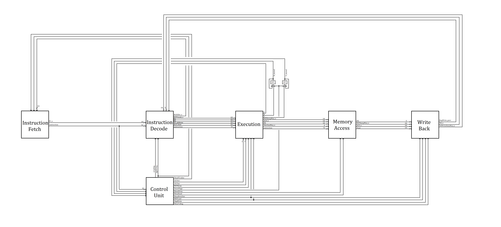
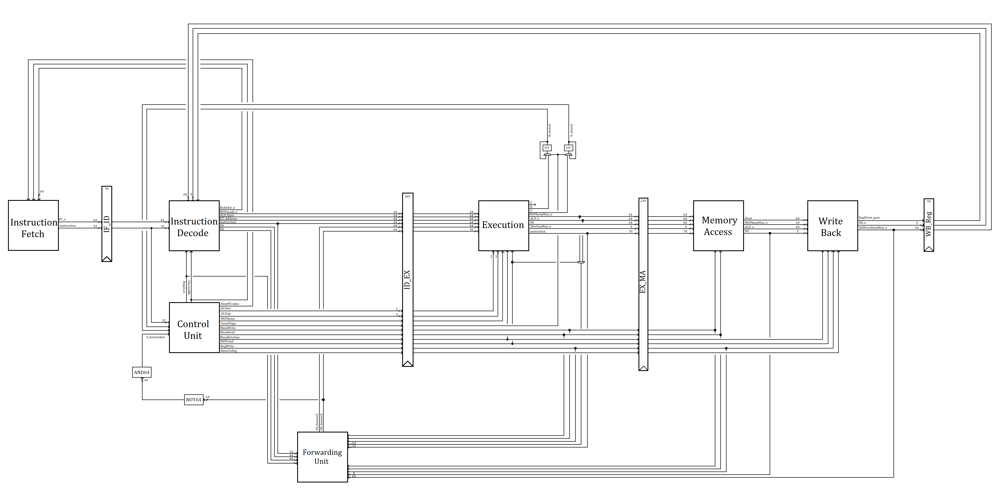

# 5-Stage Pipelined ARM Processor

Gate-Level implementation of a Reduced-Instruction Set 64-bit ARM Processor.

Includes both a single-stage and a 5-stage pipelined processor.

Based on the LEGv8 specification in *Computer Organization and Design, The Hardware Software Interface: ARM EDITION* by David A. Patterson and John L. Hennessy.

This project is an adaptation of a Lab from my university coursework.

### **While this code is open-source, submitting copied code for a grade at any educational institution is considered plagarism.**

## File Structure Overview

Folder | Description
--- | ---
`./arithmetic` | Contains ALU and related arithmetic submodules
`./benchmarks` | Contains ARM benchmark test scripts
`./decoders` | Contains decoder modules
`./otherModules` | Contains modules not categorized by the other folders
`./multiplexors` | Contains mux modules
`./processor` | Contains processor-specific modules
`./registerFile` | Contains register file and related submodules

## Instruction Set

Instruction | Description
--- | ---
`ADDI Rd, Rn, Imm12`  | Reg[Rd] = Reg[Rn] + ZeroExtend(Imm12)
`ADDS Rd, Rn, Rm`  | Reg[Rd] = Reg[Rn] + Reg[Rm]; Set flags
`SUBS Rd, Rn, Rm`  | Reg[Rd] = Reg[Rn] - Reg[Rm]; Set flags
`B Imm26`  | PC = PC + SignExtend(Imm26 << 2).
`B.LT Imm19`  | (N != V) ? PC = PC + SignExtend(Imm19<<2) : PC = PC + 4
`CBZ Rd, Imm19`  | (Reg[Rd] == 0) ? PC = PC + SignExtend(Imm19<<2) : PC = PC + 4
`LDUR Rd, [Rn, #Imm9]`  | Reg[Rd] = Mem[Reg[Rn] + SignExtend(Imm9)]
`LDURB Rd, [Rn, Imm9]`  | Reg[Rd] = {56’b0, Mem[Reg[Rn] + SignExtend(Imm9)][7:0]}
`STUR Rd, [Rn, #Imm9]`  | Mem[Reg[Rn] + SignExtend(Imm9)] = Reg[Rd]
`STURB Rd, [Rn, Imm9]`  | Mem[Reg[Rn] + SignExtend(Imm9)][7:0] = Reg[Rd][7:0]
`MOVK Rd, Imm16, LSL Shamt`  | Reg[Rd][16*Shamt+15:16*Shamt] = Imm16
`MOVZ Rd, Imm16, LSL Shamt`  | Reg[Rd] = Imm16 << (16*Shamt)

*NOTE:*  
*In the Pipelined Processor, B.LT and CBZ have delay slots*  
*For the Pipelined LDUR command, the value of Rd cannot be used in the following cycle*  
*The value for 'BrTaken' is used for internal Control Logic Calculations*

## Top-Level Single-Cycle Processor Diagram

## Top-Level Pipelined Processor Diagram

