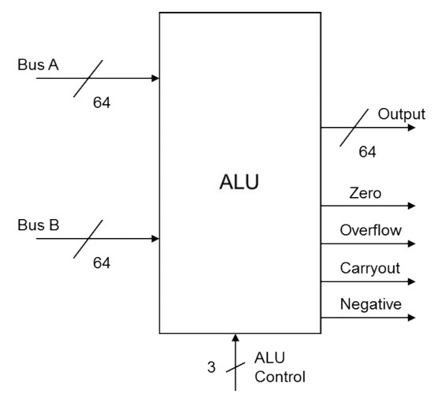
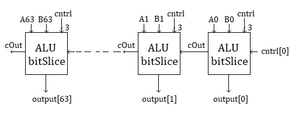
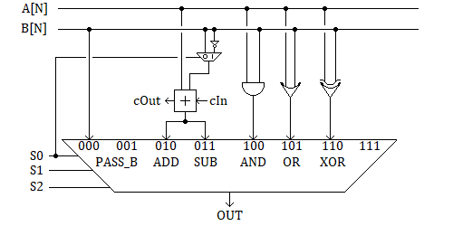

# Arithmetic Logic Unit

## Implementing a 64-bit ALU:

*The ALU is comprised of 64 bit-slices for each bit of the inputs.*

## Example configuration of 'bit-slice' modules (Next Level Down):

*Note: For a subtraction operation, the value of S0 will be 1*

*Each bit-slice module contains each function available to our ALU, connected by a mux to the output*

An individual 'bit-slice' of the ALU:
Mux Input | Operation | Notes
---|---|---
000|result = B|value of overflow and carry_out unimportant
010|result = A + B|
011|result = A - B|
100|result = bitwise A & B|value of overflow and carry_out unimportant
101|result = bitwise A OR B|value of overflow and carry_out unimportant
110|result = bitwise A XOR B|value of overflow and carry_out unimportant

We note that from the diagram, we can mux the polarity of **B** with **S0**  
For non-used mux inputs, we leave the wires as is

