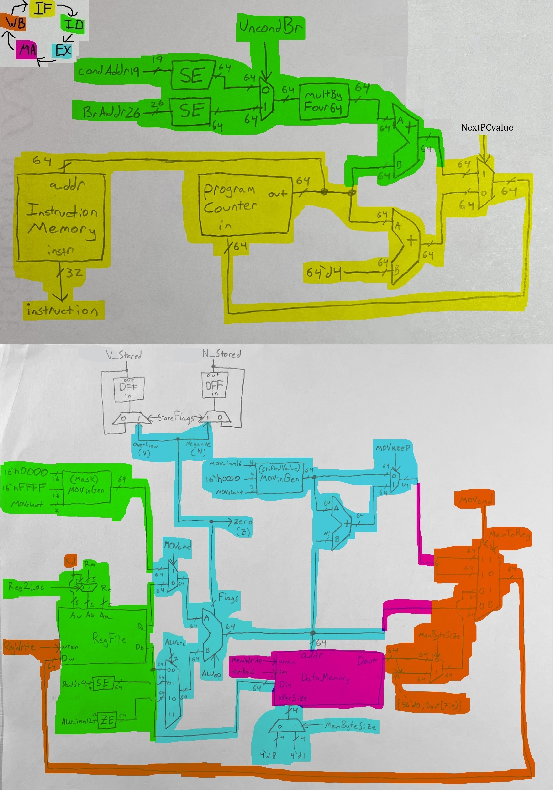
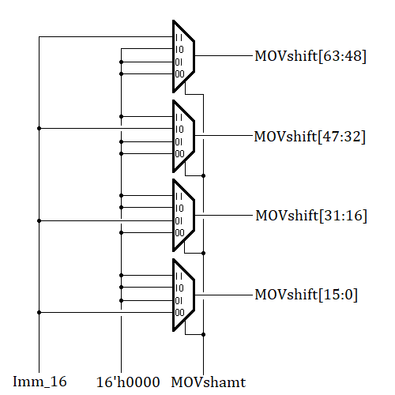
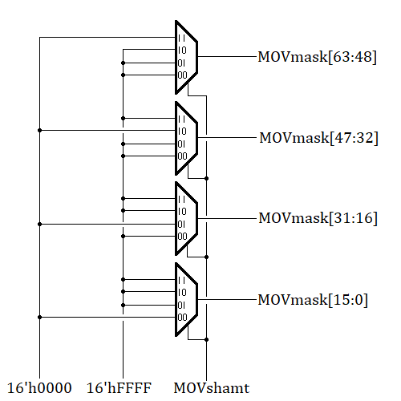
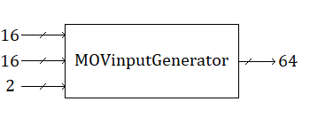
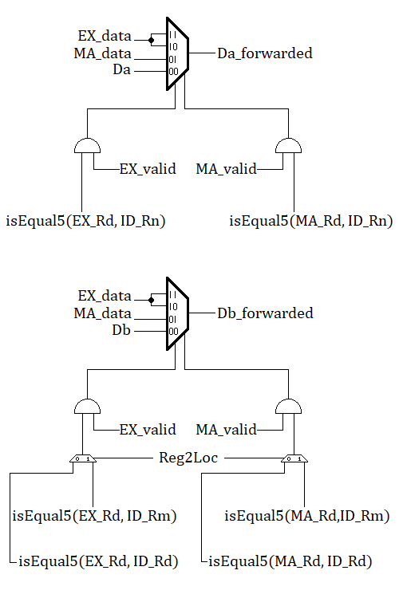

# 64-Bit ARM Processor Details

## Control Unit

 Control Unit Truth Table 

Operation | ADDI | ADDS | SUBS | B   | B.LT | CBZ | LDUR | LDURB | STUR | STURB | MOVK | MOVZ | No-Op
---       | ---  | ---  | ---  | --- | ---  | --- | ---  | ---   | ---  | ---   | ---  | ---  | ---
Instr[31:26] | 100100 | 101010 | 111010 | 000101 | 010101 | 101101 | 111110 | 001110 | 111110 | 001110 | 111100 | 110100 | xxxxxx
Instr[25:21] | 0100x  | 11000  | 11000  | xxxxx  | 00xxx  | 00xxx  | 00010  | 00010  | 00000  | 00000  | 101xx  | 101xx  | xxxxx
Instr[4:0]   | xxxxx  | xxxxx  | xxxxx  | xxxxx  | 01011  | xxxxx  | xxxxx  | xxxxx  | xxxxx  | xxxxx  | xxxxx  | xxxxx  | xxxxx
Reg2Loc        | x | 1 | 1 | x | x | 0 | x | x | 0 | 0 | 0 | x | x
MemToReg       | 0 | 0 | 0 | x | x | x | 1 | 1 | x | x | 0 | 0 | x
MOVcmd         | 0 | 0 | 0 | x | x | x | 0 | 0 | 0 | 0 | 1 | 1 | x
StoreFlags     | 0 | 1 | 1 | 0 | 0 | 0 | 0 | 0 | 0 | 0 | 0 | 0 | 0
MOVkeep        | x | x | x | x | x | x | x | x | x | x | 1 | 0 | x
MemByteSize    | x | x | x | x | x | x | 0 | 1 | 0 | 1 | x | x | x
RegWrite       | 1 | 1 | 1 | 0 | 0 | 0 | 1 | 1 | 0 | 0 | 1 | 1 | 0
MemWrite       | 0 | 0 | 0 | 0 | 0 | 0 | 0 | 0 | 1 | 1 | 0 | 0 | 0
MemRead        | 0 | 0 | 0 | 0 | 0 | 0 | 1 | 1 | 0 | 0 | 0 | 0 | 0
UncondBr       | x | x | x | 1 | 0 | 0 | x | x | x | x | x | x | x
BrTaken        | 0 | 0 | 0 | 1 | 1 | 1 | 0 | 0 | 0 | 0 | 0 | 0 | 0
NextPCvalue    | 0 | 0 | 0 | 1 | Z | $$N_{stored}\oplus V_{stored}$$ | 0 | 0 | 0 | 0 | 0 | 0 | 0
ALUsrc         | 10| 00| 00| xx| xx| 00| 01| 01| 01| 01| 00| xx | xx
ALUOp | ADD | ADD | SUB | x | x | PASS_B | ADD | ADD | ADD | ADD | AND | x | x

## Data Path

 Data Path and Submodules 

With all logic on one diagram *(excluding the Control Path), and by dividing this Processor into segments, we can beter understand it at a Top Level:

Acronym | Segment Name
--- | ---
IF | Instruction Fetch
ID | Instruction Decode
EX | Execution
MA | Memory Access
WB | Write Back

## Handling MOV Commands

 MOV Command Implementation 

*MOV commands both WRITE to Rd*

Instr[29] (MOVkeep) is the differentiating factor:  
Instr[29] == 1; MOVK  
Instr[29] == 0; MOVZ  

MOV commands both shift based on Instr[22:21] (MOVshamt)

We can implement MOV shift operations with Four 16-bit 4x1 multiplexors:

MOVZ completely overwrites `Rd` with the shifted input value

Current value in Rd is not important

LSL is selected by Instr[22:21]

Instr[22:21] | RTL
--- | ---
00 | Reg[Rd] = Imm_16 << 0;
01 | Reg[Rd] = Imm_16 << 16;
10 | Reg[Rd] = Imm_16 << 32;
11 | Reg[Rd] = Imm_16 << 48;

MOVK keeps the other values in `Rd`  
This requires applying a bitmask with an AND operation in our main ALU unit  
In parallel, we shift the input immediate by the desired amount  
Once complete, we then perform addition in an ADD-only ALU unit with the result from the bitmask and our shifted immediate  
Given [63:0] endian-ness:

Instr[22:21] | RTL
--- | ---
00 | Reg[Rd] = Reg[Rd] & 0xFF_FF_FF_00; Reg[Rd] = Reg[Rd] + Imm_16;
01 | Reg[Rd] = Reg[Rd] & 0xFF_FF_00_FF; Reg[Rd] = Reg[Rd] + (Imm_16 << 16);
10 | Reg[Rd] = Reg[Rd] & 0xFF_00_FF_FF; Reg[Rd] = Reg[Rd] + (Imm_16 << 32);
11 | Reg[Rd] = Reg[Rd] & 0x00_FF_FF_FF; Reg[Rd] = Reg[Rd] + (Imm_16 << 48);

We can determine the MOV masks for the main ALU with the same module as the shifter:

Combining the modules, they can now be abstracted in our top-level processor design:

## Handling LDURB/STURB

 Single-Byte Memory Reads/Writes 

To handle single-byte reads and writes, we make use of the `xferSize` input to `datamem.sv`

Transfer size allows for single-byte, half-word, word, and double-word writes/reads to/from memory

Because our instruction set only includes [LDUR, STUR, LDURB, STURB], we will only need a 4-bit 2x1 mux to handle the inputs

We create control signal `MemByteSize`, where a 1 indicates a LDURB/STURB command, while a 0 indicates a LDUR/STUR

## The Program Counter

 Creating the Program Counter 

The Program Counter is a 64-bit value that acts like a register.

The Program Counter will always be write-enabled, as it updates after each clock cycle.

Our Program Counter will be a simplified version of a 64-bit Register without Write-Enable logic.

## Differentiating Conditional Branches

 Conditional Branch Type 

The differentiating facor between a CBZ and a B.LT is a signal called `CondBrType`, which is defined by `Instr[30]`

CondBrType | Branch Instruction
--- | ---
0 | CBZ
1 | B.LT

Using this signal and other combinational logic, we can mux the next Program Counter value appropriately

## Storing ALU Flags in a Single-Stage Processor

 Handling Flag Storage 

The main ALU module (the one that takes ALUop as an input) produces flags that are used to determine conditional branches.

These flags are only stored during `ADDS` and `SUBS` operations, and need to be available for the next command.

We can store flag values in DFF's and only update the value during one of these commands.

In a single-cycle system, we can safely assume our previous value will be available for the full cycle

We need a control signal `StoreFlags` to indicate when to update the DFFs

The `CBZ` command uses the zero flag for the IMMEDIATE ALU operation

This means that we would NOT use the flag stored in the DFFs, rather the ALU output from the CURRENT clock cycle

## Pipelined Processor Changes

 Considerations for the Pipelined Processor 

### Branch Acceleration

The decision to branch can be determined in the Instruction Decode stage, and the `B` command can be immediately resolved.

By testing the value of (Db_forwarded == 0) and sending that signal into the control unit, we can prematurely detect and act on a `CBZ` command.

However, the `B.LT` command is seemingly blocked until the ALU flags are generated after the Execution phase.

Our 'stored' flag flip-flops from the single-stage pipeline would represent the value in the MA stage of the pipelined processor,
but we need to be able to access those values BEFORE MA to take a `B.LT` branch by the end of EX.

By inverting the clock signal to the stored flag flip flops `~clk`, we allow the stored flags to be available for the second half-cycle of the Execution stage.

### Forwarding Unit

 Forwarding Unit Details 

Control Signal | Value | Description
--- | --- | ---
ID_Rn | ID_instruction[9:5] | Rn for Instruction Decode
ID_Rm | ID_instruction[20:16] | Rm for Instruction Decode
ID_Rd | ID_instruction[4:0] | Rd for Instruction Decode
EX_Rd | EX_instruction[4:0] | Rd for Execution
EX_isBranch | ~EX_MemWrite && ~EX_MemRead && ~EX_RegWrite                | If the Execution command is a Branch
EX_isStore  | EX_MemWrite && ~EX_MemRead && ~EX_RegWrite                 | If the Execution command is a Store
EX_isLoad   | ~EX_MemWrite && EX_MemRead && EX_RegWrite                  | If Execution command is a Load
EX_isX31    | isEqual5(EX_Rd, 5'd31)                                           | If Rd for Execution is X31
EX_isValid  | ~EX_isBranch && ~EX_isStore && ~EX_isLoad && ~EX_isX31  | Validity of Execution output for forwarding
MA_isBranch | ~MA_MemWrite && ~MA_MemRead && ~MA_RegWrite                | If the Memory Access command is a Branch
MA_isStore  | MA_MemWrite && ~MA_MemRead && ~MA_RegWrite                 | If the Memory Access command is a Store
MA_isX31    | isEqual5(MA_Rd, 5'd31)                                           | If Rd for Memory Access is X31
MA_isValid  | ~MA_isBranch && ~MA_isStore && ~MA_isX31                   | Validity for Memory Access output for forwarding

The `Forwarding Unit` module has been added to handle forwarding for the pipelined processor. This module is placed outside of the pipeline, between Instruction Decode and Execution, and resolves values passed into the execution stage.

The unit takes Register File IO from the current ID, ALU outputs from the past EX, and DataMem/MOV/ALU outputs from the past MA. By comparing the instruction for each stage, as well as the values for Rd, Rn, Rm, we determine what the updated EX ALU input values must be BEFORE proceeding into EX.

This unit has a few key exceptions that prevent unwanted behavior from occuring:

If the previous instruction was a branch, the output from that instruction can be ignored.

If both EX and MA attempt to write to the SAME register, we give port-priority to the EX stage: we assume that in a previous stage, the updated register value (that we are getting from MA currently) was sent to the EX stage one cycle ago, and that the most recent update to the register is reflected in the output from EX.

A value 'calculated' for register X31 will NEVER be forwarded, as it should always be zero.

If any future command was a STORE command `STUR/STURB` we do not need to forward the value.

An `LDUR/LDURB` command can only forward TWO stages ahead (from MA), as our implementation will not have the value from Data Memory until the end of MA. Whatever command is set to execute after a load will execute regardless to the requested changes to `Rd`, and cannot recieve the value from a LOAD command executed ONE CYCLE before it.

### Additional Work-Arounds

In order to update the value for `Rd` in the register file with the value determined in Write-Back before completing the rest of Instruction Decode, we invert the clock signal `~clk` to the register file.

The pipelined unit conjoins the 'Memory Access' and 'Write Back' modules within a single stage.

This appears contradictory to the system, but in hardware the Write Back phase only performs mux operations that are needed
to determing MA_data for the Forwarding Unit.

