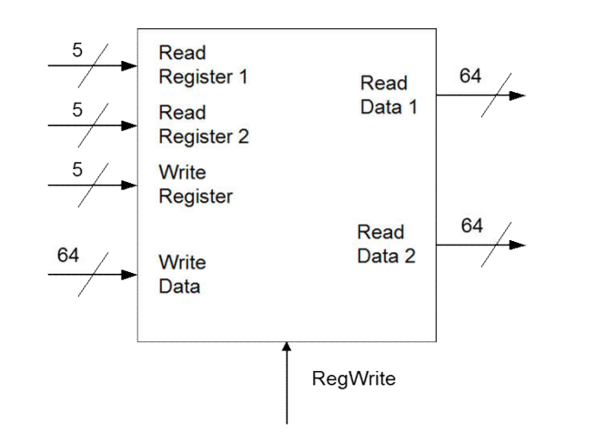
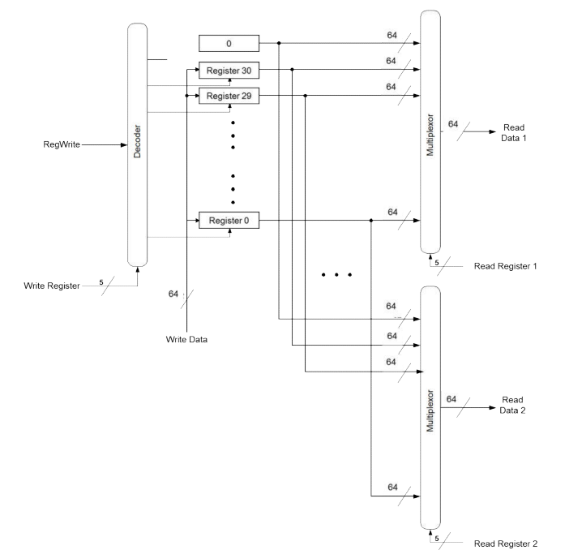

# Register File
## At the Top Level:

## At the next level down:

## The register file is comprised of:

`31 64-bit registers:`

The last indexed register (register 32) will always return zero

*this can be represented as a constant `64'd0`*

Each register is comprised of 64 Data Flip-Flops

Our register should allow for paramaterized size

`A 5:32 Enabled Decoder:`

Selected output acts as 'Write-enable' for 'Write Register'

The desired register address is the 5-bit input

We will design a generic decoder with paramaterized size

`Two 32:1 Muxes, each IO wire is a 64-bit value:`

Handle read address 0 and 1 (5-bit inputs)

Allows for parallel reads of multiple addresses

We will design a generic mux with fully paramaterized inputs

